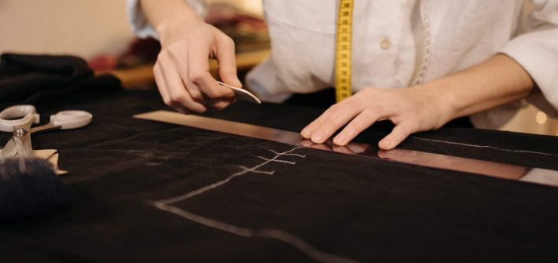
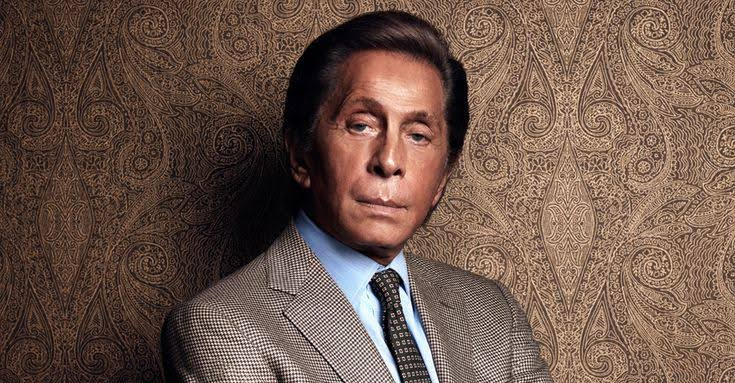

# História da Loja Valentino

# Quem é a pessoa por trás da marca?
---
 
Assim como outras gigantes da moda, a **[Valentino](https://pt.m.wikipedia.org/wiki/Valentino_Garavani)** também é a representação pessoal de um estilista talentoso, ousado e muito bem conceituado. E quem é o grande responsável por criar uma das mais importantes marcas da história da moda é o italiano **Valentino Garavani.**

---

 
**Garavani** nasceu no ano de 1932, em uma comuna chamada Voghera, na Lombardia, região mais populosa da Itália. Ao entrar na vida adulta, dedicou-se aos estudos e começou a dar os primeiros passos de seu império.

Autêntico, todo o amor de Valentino pela moda foi passado para suas criações. E, com isso, tornou-se um ícone, uma das maiores personalidades da história. 

# Quando foi fundada as Loja Valentino?
---
 
Já de volta à Itália, Valentino inaugurou seu primeiro estúdio de moda, em Roma, no ano de 1959. Daí em diante, a história foi escrita como conhecemos: com um império que fez de Valentino um dos principais nomes da história da moda.

Atualmente, a marca faz parte do *Valentino Fashion Group*, que é um consórcio italiano de empresas de moda de luxo. Esse consórcio, por sua vez, pertence a um grupo de investimentos do **[Catar](https://pt.m.wikipedia.org/wiki/Catar)**.

